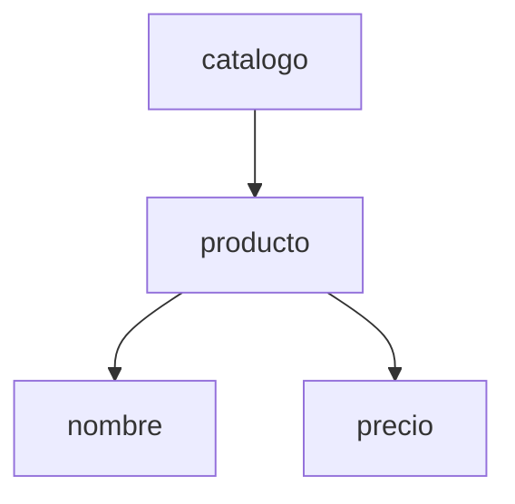

# Bloque 2. Elementos, estructura y semántica

## 1. Componentes básicos

La terminología exacta depende del lenguaje, pero los siguientes conceptos permiten analizar muchos documentos de marcas.

### 1.1. Etiqueta

Una **etiqueta** es una marca que identifica el inicio, el final o la función de una parte del documento.

```html
<p>Hola, mundo</p>
```

- `<p>` es la etiqueta de apertura.
- `</p>` es la etiqueta de cierre.

### 1.2. Elemento

Un **elemento** es la unidad completa formada por sus etiquetas, atributos y contenido.

```xml
<nombre>Ada Lovelace</nombre>
```

Todo el fragmento es el elemento `nombre`. Por tanto, **etiqueta** y **elemento** no son sinónimos.

Algunos elementos no tienen contenido textual:

```xml
<disponible />
```

### 1.3. Atributo

Un **atributo** añade información asociada a un elemento y suele escribirse en la etiqueta inicial.

```html

```

`src` y `alt` son atributos; sus valores son `logo.svg` y `Logotipo del centro`.

> [!IMPORTANT]
> Un atributo no es una etiqueta. Además, la decisión de expresar algo como atributo o como elemento depende de las reglas y el diseño del lenguaje.

### 1.4. Contenido

El contenido puede ser texto, otros elementos o una combinación de ambos.

```xml
<persona>
  <nombre>Samira</nombre>
  <ciudad>Sevilla</ciudad>
</persona>
```

El elemento `persona` contiene otros dos elementos.

### 1.5. Comentario

Los comentarios sirven para incluir aclaraciones que no forman parte del contenido principal. Su sintaxis cambia entre lenguajes.

```html
<!-- Este bloque se revisará en la próxima versión -->
```

Los comentarios no deben utilizarse para guardar contraseñas, claves o información privada: siguen formando parte del archivo.

### 1.6. Declaraciones e instrucciones de procesamiento

Algunos lenguajes admiten construcciones que proporcionan información al procesador. En XML puede aparecer una declaración al comienzo:

```xml
<?xml version="1.0" encoding="UTF-8"?>
```

Esta línea informa de la versión y la codificación. No representa un elemento del contenido.

### 1.7. Entidades y caracteres reservados

Determinados símbolos tienen un significado especial en la sintaxis y no pueden escribirse siempre de forma directa. En HTML, por ejemplo:

```html
<p>5 &lt; 10</p>
<p>Lenguajes de Marcas &amp; Desarrollo Web</p>
```

`&lt;` representa `<` y `&amp;` representa `&`. Estas referencias evitan que el procesador confunda contenido con marcas.

## 2. Jerarquía y estructura de árbol

En muchos lenguajes, los elementos se anidan y forman un árbol:

```xml
<catalogo>
  <producto>
    <nombre>Teclado</nombre>
    <precio moneda="EUR">39.95</precio>
  </producto>
</catalogo>
```



- `catalogo` es el elemento raíz.
- `producto` es hijo de `catalogo`.
- `nombre` y `precio` son hermanos.
- `catalogo` es antecesor de `precio`.
- El atributo `moneda` pertenece al elemento `precio`.

Esta estructura permite que un programa recorra, consulte o transforme el documento.

### 2.1. Relaciones dentro del árbol

Para hablar de la estructura se emplean relaciones familiares:

- **Raíz:** elemento superior que contiene el documento.
- **Padre:** elemento que contiene directamente a otro.
- **Hijo:** elemento contenido directamente en otro.
- **Hermanos:** elementos con el mismo padre.
- **Antecesor:** elemento situado por encima, aunque no sea el padre directo.
- **Descendiente:** elemento situado por debajo en cualquier nivel.

Esta terminología será necesaria posteriormente para XPath, el DOM y la manipulación de páginas con JavaScript.

### 2.2. Orden y anidamiento

El orden puede tener significado. No siempre es equivalente escribir primero un título o colocarlo después del contenido.

Además, los elementos deben cerrarse respetando el orden inverso al de apertura:

```xml
<!-- Correcto -->
<p><strong>Importante</strong></p>

<!-- Incorrecto -->
<p><strong>Importante</p></strong>
```

En el segundo caso, los elementos se cruzan en lugar de estar correctamente anidados.

## 3. Contenido, estructura, presentación y comportamiento

En desarrollo web conviene separar responsabilidades:

| Capa | Pregunta | Tecnología habitual |
|---|---|---|
| Contenido | ¿Qué información ofrecemos? | Texto, imágenes, datos |
| Estructura y semántica | ¿Qué significa cada parte? | HTML |
| Presentación | ¿Cómo se muestra? | CSS |
| Comportamiento | ¿Qué ocurre al interactuar? | JavaScript |

Ejemplo:

```html
<h1>Ofertas de la semana</h1>
```

HTML indica que el texto es el encabezado principal. No debería elegirse `h1` solo porque el navegador lo muestre grande; su función es estructural y semántica. CSS podrá cambiar su aspecto sin modificar su significado.

```css
h1 {
  color: rebeccapurple;
}
```

### ¿Por qué separar responsabilidades?

- Facilita el mantenimiento.
- Permite reutilizar contenido.
- Mejora la accesibilidad.
- Ayuda a los buscadores a interpretar la página.
- Evita mezclar significado, diseño y lógica.
- Facilita que varias personas trabajen en el mismo proyecto.

### Ejemplo completo de separación

```html
<button id="guardar">Guardar cambios</button>
```

```css
#guardar {
  background-color: navy;
  color: white;
}
```

```javascript
document.querySelector("#guardar").addEventListener("click", () => {
  console.log("Cambios guardados");
});
```

- HTML declara que existe un botón y aporta significado.
- CSS decide su apariencia.
- JavaScript define qué sucede al pulsarlo.

Aunque las tres tecnologías colaboran, solo HTML es aquí un lenguaje de marcas.

## 4. Sintaxis, semántica y vocabulario

Estos conceptos no son equivalentes:

- **Sintaxis:** reglas para escribir correctamente.
- **Semántica:** significado de las construcciones.
- **Vocabulario:** conjunto de marcas o nombres disponibles.

Un fragmento puede ser sintácticamente aceptable pero estar mal elegido desde el punto de vista semántico. Por ejemplo, usar un párrafo como si fuera un encabezado puede producir texto visible, pero no comunica correctamente la estructura del documento.

También debemos distinguir el **contenido** del **modelo del documento**:

```html
<h2>Noticias</h2>
```

- `Noticias` es el contenido textual.
- `h2` pertenece al vocabulario de HTML.
- Las etiquetas siguen una sintaxis.
- El elemento comunica la semántica de encabezado de segundo nivel.

## 5. Documento bien formado y documento válido

Como introducción:

- Un documento está **bien formado** cuando respeta las reglas sintácticas básicas del lenguaje.
- Un documento es **válido** cuando, además, cumple un conjunto concreto de reglas sobre qué elementos, atributos y estructuras están permitidos.

Estos conceptos se desarrollarán al estudiar XML, DTD y XML Schema.

### Ejemplo introductorio

Supongamos que un vocabulario permite un elemento `alumno` con un `nombre` y un `correo` obligatorios:

```xml
<alumno>
  <nombre>Noa</nombre>
</alumno>
```

El fragmento puede estar bien formado porque las etiquetas están correctamente cerradas. Sin embargo, no sería válido respecto de esas reglas porque falta `correo`.

Por tanto:

```text
válido ⇒ debe estar bien formado
bien formado ⇏ necesariamente válido
```

Una analogía útil:

- «La alumnos estudia» contiene palabras reconocibles, pero no respeta la concordancia: sería un problema de forma.
- «El alumnado conduce una raíz cuadrada» puede ser gramatical, pero no tiene sentido en un contexto normal: sería un problema de significado.

## 6. Lenguajes definidos y lenguajes extensibles

En HTML, el vocabulario está definido por su estándar: no podemos inventar una etiqueta `<precio-oferta>` y esperar que el navegador le atribuya un significado estándar.

XML, en cambio, es un **metalenguaje**: proporciona reglas para crear vocabularios adaptados a distintos ámbitos.

```xml
<videojuego>
  <titulo>Celeste</titulo>
  <plataforma>PC</plataforma>
</videojuego>
```

Que podamos crear los nombres no significa que el documento se explique por sí mismo a cualquier programa. Emisor y receptor deben compartir las reglas del vocabulario.

## 7. ¿Cómo procesa una aplicación un documento?

De forma general, el proceso puede resumirse así:

1. **Lectura:** la aplicación obtiene los caracteres del archivo o de la red.
2. **Análisis léxico y sintáctico:** reconoce marcas, atributos y contenido.
3. **Construcción de una representación:** puede crear un árbol en memoria.
4. **Validación opcional:** comprueba el documento respecto de reglas adicionales.
5. **Procesamiento:** muestra, consulta, transforma o almacena la información.

El componente que analiza el documento suele denominarse **parser** o **analizador**.

```text
Documento → analizador → estructura interna → presentación o procesamiento
```

Un navegador realiza este trabajo con HTML y construye el **DOM**. Más adelante, JavaScript podrá consultar y modificar ese modelo.

## 8. Esquema, instancia y vocabulario

- El **vocabulario** reúne los nombres y construcciones disponibles.
- El **esquema** expresa reglas sobre la estructura permitida.
- Una **instancia** es un documento concreto que utiliza ese vocabulario.

Ejemplo:

```text
Vocabulario: pedido, cliente, producto, cantidad
Esquema: todo pedido debe tener un cliente y al menos un producto
Instancia: el archivo pedido-1042.xml
```

Esta distinción será esencial en las unidades dedicadas a DTD y XML Schema.

## Ideas clave

- Los elementos forman estructuras jerárquicas.
- Las etiquetas delimitan elementos; no son el elemento completo.
- La semántica explica qué significa cada parte.
- En la web, HTML, CSS y JavaScript tienen responsabilidades distintas.
- La corrección sintáctica no garantiza una buena elección semántica.

---