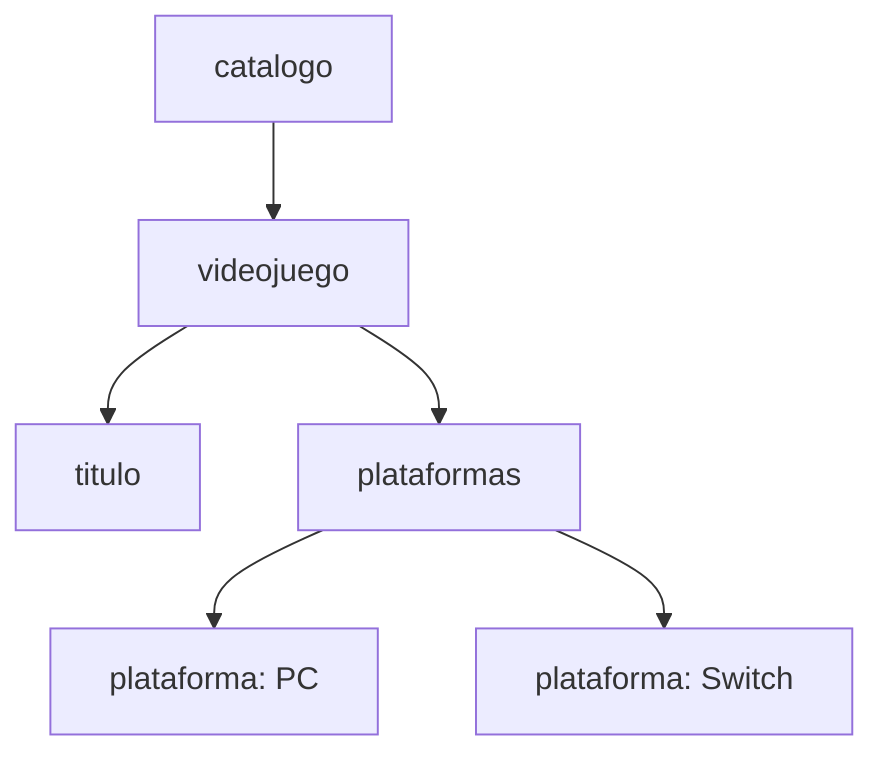

# Bloque 3. Estructura jerárquica y diseño

[← Sintaxis](02-sintaxis-y-componentes.md) · [Índice](README.md) · [Siguiente: buena formación →](04-documentos-bien-formados.md)

## Objetivos del bloque

- Interpretar un documento XML como un árbol.
- Utilizar correctamente raíz, padres, hijos, hermanos y descendientes.
- Diseñar documentos XML claros y coherentes.
- Representar listas, datos opcionales y estructuras repetidas.

## 1. El modelo de árbol

Un documento XML posee una estructura jerárquica. Todos sus elementos forman un árbol con un único elemento raíz.

```xml
<catalogo>
  <videojuego id="V001">
    <titulo>Celeste</titulo>
    <plataformas>
      <plataforma>PC</plataforma>
      <plataforma>Switch</plataforma>
    </plataformas>
  </videojuego>
</catalogo>
```



## 2. Terminología del árbol

- **Nodo:** componente de la estructura, como un elemento o un texto.
- **Raíz:** elemento superior que contiene los demás.
- **Padre:** elemento que contiene directamente a otro.
- **Hijo:** elemento contenido directamente por otro.
- **Hermanos:** elementos que comparten padre.
- **Antecesor:** elemento situado en un nivel superior.
- **Descendiente:** elemento situado en cualquier nivel inferior.
- **Hoja:** nodo que no contiene otros elementos.

En el ejemplo:

- `catalogo` es la raíz.
- `videojuego` es hijo de `catalogo`.
- `titulo` y `plataformas` son hermanos.
- Las dos apariciones de `plataforma` son hijas de `plataformas`.
- `catalogo` es antecesor de todos los elementos.

## 3. Un único elemento raíz

Todo documento XML debe tener exactamente un elemento raíz.

```xml
<!-- Incorrecto: dos elementos de nivel superior -->
<titulo>Celeste</titulo>
<titulo>Hades</titulo>
```

La solución es envolverlos en un contenedor:

```xml
<catalogo>
  <titulo>Celeste</titulo>
  <titulo>Hades</titulo>
</catalogo>
```

El nombre de la raíz debe representar adecuadamente el conjunto del documento.

## 4. Representación de colecciones

Una colección puede expresarse repitiendo elementos:

```xml
<catalogo>
  <videojuego id="V001">
    <titulo>Celeste</titulo>
  </videojuego>
  <videojuego id="V002">
    <titulo>Hades</titulo>
  </videojuego>
</catalogo>
```

Para una propiedad multivaluada, suele ser útil un contenedor:

```xml
<plataformas>
  <plataforma>PC</plataforma>
  <plataforma>Switch</plataforma>
</plataformas>
```

El contenedor hace explícito que los elementos forman una colección y permite añadir metadatos al conjunto si fueran necesarios.

## 5. Datos simples y datos compuestos

Un dato simple contiene un valor:

```xml
<titulo>Hades</titulo>
```

Un dato compuesto se divide en partes:

```xml
<desarrolladora>
  <nombre>Supergiant Games</nombre>
  <pais>Estados Unidos</pais>
</desarrolladora>
```

La segunda estructura permite consultar cada parte por separado.

## 6. Información obligatoria, opcional y repetida

XML por sí solo no indica formalmente qué elementos son obligatorios. Esa regla pertenece al vocabulario y podrá expresarse mediante DTD o XML Schema.

Podemos documentar inicialmente las reglas:

```text
- Todo videojuego tendrá exactamente un título.
- Puede tener cero o una descripción.
- Tendrá una o varias plataformas.
```

Ejemplo con descripción opcional ausente:

```xml
<videojuego id="V002">
  <titulo>Hades</titulo>
  <plataformas>
    <plataforma>PC</plataforma>
  </plataformas>
</videojuego>
```

La ausencia de un elemento no debe confundirse automáticamente con un elemento vacío:

```xml
<descripcion />
```

En un caso no existe el elemento; en el otro existe, pero no tiene contenido. La aplicación debe definir qué significa cada situación.

## 7. Orden de los elementos

En XML, el orden forma parte del documento:

```xml
<persona>
  <nombre>Ana</nombre>
  <apellido>García</apellido>
</persona>
```

No debe asumirse que intercambiar `nombre` y `apellido` produce siempre el mismo resultado. Un esquema o una aplicación pueden exigir un orden concreto.

## 8. Identificadores y referencias

Podemos identificar recursos mediante atributos:

```xml
<desarrolladora id="D01">
  <nombre>Supergiant Games</nombre>
</desarrolladora>

<videojuego id="V002" desarrolladora-ref="D01">
  <titulo>Hades</titulo>
</videojuego>
```

El texto `D01` funciona como referencia por acuerdo del vocabulario. XML básico no comprueba automáticamente que la referencia exista o sea única. Estas restricciones requieren validación o lógica de aplicación.

## 9. Evitar duplicidad innecesaria

Este diseño repite datos:

```xml
<videojuego>
  <titulo>Hades</titulo>
  <desarrolladora>Supergiant Games</desarrolladora>
  <pais-desarrolladora>Estados Unidos</pais-desarrolladora>
</videojuego>
```

Si muchos juegos pertenecen a la misma empresa, podría interesar separar desarrolladoras y referenciarlas. Sin embargo, un documento de intercambio autocontenido puede preferir cierta repetición.

El diseño depende de:

- Cómo se consulta la información.
- Si el documento debe ser autocontenido.
- El tamaño y la frecuencia de actualización.
- Las herramientas que lo procesarán.
- Las reglas del estándar utilizado.

## 10. Criterios para elegir elementos y atributos

### Utiliza normalmente elementos cuando:

- La información es parte principal del contenido.
- Puede repetirse.
- Puede contener subestructura.
- Puede crecer en el futuro.
- El orden con otros datos resulta significativo.

### Utiliza normalmente atributos cuando:

- Es un identificador.
- Es una propiedad breve del elemento.
- Actúa como metadato.
- No necesita subestructura.

Ejemplo equilibrado:

```xml
<videojuego id="V001" estado="publicado">
  <titulo>Celeste</titulo>
  <precio moneda="EUR">19.99</precio>
</videojuego>
```

No es una ley universal. Lo importante es definir y aplicar criterios coherentes.

## 11. Diseño progresivo del catálogo

### Requisitos

- El catálogo contiene varios videojuegos.
- Cada videojuego tiene identificador, título, desarrolladora y precio.
- Puede publicarse en varias plataformas.
- El precio debe indicar la moneda.
- Puede incluir etiquetas temáticas.

### Propuesta

```xml
<?xml version="1.0" encoding="UTF-8"?>
<catalogo fecha-actualizacion="2026-09-25">
  <videojuego id="V001">
    <titulo>Celeste</titulo>
    <desarrolladora>
      <nombre>Extremely OK Games</nombre>
      <pais>Canadá</pais>
    </desarrolladora>
    <plataformas>
      <plataforma>PC</plataforma>
      <plataforma>Switch</plataforma>
    </plataformas>
    <precio moneda="EUR">19.99</precio>
    <etiquetas>
      <etiqueta>plataformas</etiqueta>
      <etiqueta>indie</etiqueta>
    </etiquetas>
  </videojuego>
</catalogo>
```

### Decisiones tomadas

- `catalogo` es la raíz porque agrupa la colección.
- `videojuego` se repite una vez por producto.
- `id` identifica cada videojuego.
- `desarrolladora` es compuesta porque posee nombre y país.
- `plataformas` y `etiquetas` contienen listas.
- `moneda` describe la interpretación de `precio`.

## Actividad breve

Diseña la estructura de una biblioteca con estas reglas:

- La raíz será `biblioteca`.
- Contendrá varios libros.
- Cada libro tendrá ISBN, título y autoría.
- Un libro podrá tener varios autores.
- El préstamo será opcional.
- Si está prestado, se registrará usuario y fecha de devolución.

Primero dibuja el árbol y después escribe el XML.

---

[← Sintaxis](02-sintaxis-y-componentes.md) · [Índice](README.md) · [Siguiente: buena formación →](04-documentos-bien-formados.md)
